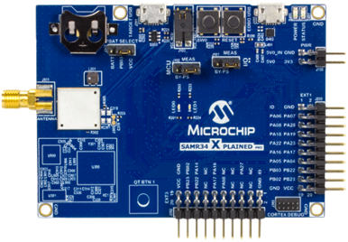
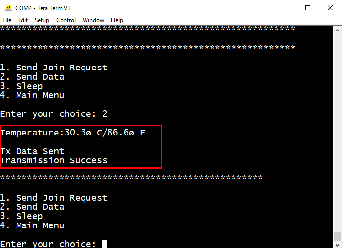

# ATSAMR34_ECC608A_TTI

> “Wireless Made Easy!" - Develop with the SAM R34 LoRa SiP and WLR089U0 Module with Microchip LoRaWAN stack on TTI join server

<a href="https://www.microchip.com/design-centers/security-ics/trust-platform/trust-go/trust-go-lora-secure-authentication-with-join-servers" target="_blank">

&nbsp;&nbsp;&nbsp;&nbsp;&nbsp;&nbsp;&nbsp

<a href="https://www.thethingsindustries.com" target="_blank">

&nbsp;&nbsp;&nbsp;&nbsp;&nbsp;&nbsp;&nbsp

</a>

## ⚠ Disclaimer

<b>
Subject to your compliance with these terms, you may use Microchip software and any derivatives exclusively with Microchip products. It is your responsibility to comply with third party license terms applicable to your use of third party software (including open source software) that may accompany Microchip software. 
THIS SOFTWARE IS SUPPLIED BY MICROCHIP "AS IS". NO WARRANTIES, WHETHER EXPRESS, IMPLIED OR STATUTORY, APPLY TO THIS SOFTWARE, INCLUDING ANY IMPLIED WARRANTIES OF NON-INFRINGEMENT, MERCHANTABILITY, AND FITNESS FOR A PARTICULAR PURPOSE. 
IN NO EVENT WILL MICROCHIP BE LIABLE FOR ANY INDIRECT, SPECIAL, PUNITIVE, INCIDENTAL OR CONSEQUENTIAL LOSS, DAMAGE, COST OR EXPENSE OF ANY KIND WHATSOEVER RELATED TO THE SOFTWARE, HOWEVER CAUSED, EVEN IF MICROCHIP HAS BEEN ADVISED OF THE POSSIBILITY OR THE DAMAGES ARE FORESEEABLE. TO THE FULLEST EXTENT ALLOWED BY LAW, MICROCHIP'S TOTAL LIABILITY ON ALL CLAIMS IN ANY WAY RELATED TO THIS SOFTWARE WILL NOT EXCEED THE AMOUNT OF FEES, IF ANY, THAT YOU HAVE PAID DIRECTLY TO MICROCHIP FOR THIS SOFTWARE.

</b>

> Interact with your peers about this software in [LoRa Forum](https://www.microchip.com/forums/f512.aspx).

## Abstract

**This guide will direct you through the process of getting started with developing a secure LoRa end device product using Microchip Technology's Pre-provisioned ATECC608A secure element along with TTI Join server.**
 
The Things Industries created a product and a service that delivers secure join, secure communication and secure key provisioning.

## Sample Applications

[Clone/Download](https://docs.github.com/en/free-pro-team@latest/github/creating-cloning-and-archiving-repositories/cloning-a-repository) the current repo to get the software.

## A la carte

1. [Material required](#step1)
2. [Software](#step2)
3. [Hardware setup](#step3)
4. [Sample Application Code](#step4)
5. [Claiming and Activating the device](#step5)
6. [Running the demo](#step6)

## Material required 

Purchase samples of the <a href="https://www.microchipdirect.com/product/search/all/ATECC08A-TNGLORA" target="_blank">ATECC608A-TNGLORA</a>
secure element 
and the <a href="https://www.microchipdirect.com/product/search/all/AT88CKSCKTUDFN-XPRO" target="_blank">CryptoAuthentication UDFN Socket Kit</a>
 

 

Purchase the <a href="https://www.microchip.com/Developmenttools/ProductDetails/DM320111" target="_blank">SAM R34 Xplained Pro Evaluation Kit</a>
 

 

Purchase the <a href="https://www.microchip.com/DevelopmentTools/ProductDetails/PartNO/EV23M25A" target="_blank">WLR089U0 Xplained Pro Evaluation Kit</a>
 

 

Purchase a LoRa(r) Gateway from <a href="https://www.thethingsindustries.com/technology/hardware#gateway" target="_blank">The Things Industries</a>
 

 

## Software 

- Download and install [Microchip Studio 7.0 IDE](https://www.microchip.com/mplab/microchip-studio).
- Open Microchip Studio 7.0 IDE.
- From **Tools - > Extensions and updates**, install Advanced Software Framework (ASFv3) v3.49.0 release or upper release.
- Restart Microchip Studio
- Download and install a serial terminal program like [Tera Term](https://osdn.net/projects/ttssh2/releases/).  

## Hardware setup 

Configure the DIP switch of the CryptoAuthenticationUDFN Socket kit for I2C communication with the host microcontroller.
**1, 3 and 6 must be placed to ON position**
 

 

Open the socket board
 

 

Make sure the ATECC608A device is ready to be inserted in the right direction.
Make sure the pin 1 of the component (represented by a point) is located at the bottom left.
 

 

Place the Secure Element in the UDFN socket
 

 

Make sure the Secure Element is properly seated and the pin 1 is located at the bottom left.
 

 
Close the clam shell lid.
 

Attach the CryptoAuthenticationUDFN Socket kit to the SAM R34 Xplained Pro board on the **EXT3 header.**
 
Plug the antenna.
Attach a USB cable to SAM R34 Xplained Pro board's EDBG micro-B port on the right. 
The USB ports powers the board and enables the user to communicate with the kits.
 

> Same setup is valid for WLR089U0 Xplained Pro as well

- Wait for USB driver installation and COM ports mounting.  
- Launch Tera Term program and configure the serial ports mounted with: **115200 bps, 8/N/1**

## Sample Application Code 

Open the "APPS_ENDDEVICE_DEMO" project with Microchip Studio 7 IDE 
From the top menu, go to Project -> APPS_ENDDEVICE_DEMO Properties 
From Tool settings, select your board as EDBG debugger with SWD interface
 

 
Build and download the project by clicking the empty green "Run without debugging" triangle
 

 
Open the Tera Term UART console previously configured at 115200 bps, 8-data bits/No parity/1-stop bit
 
Press the "Reset" button on the SAM R34 Xplained Pro board to see output printed to the console
 
Observe the following identifiers coming from the ATECC608A Secure Element
 

 

In order to pre-commission a device using ATECC608A secure element in TTI Activation, the following idenfiers are required:

- DevEUI: LoRaWAN device 64-bit unique identifier assigned by the Device manufacturer (or using Secure Element default value)
- JoinEUI: LoRaWAN JS 64-bit unique identifier of the Join Server on which AppKey of the device is stored

## Claiming and Activating the device 

TTI and Microchip developed a security solution for LoRaWAN that enables secure key provisioning and secure cryptographic operations using secure elements.
 
- <a href="https://www.thethingsindustries.com/technology/security-solution" target="_blank">End-to-end LoRaWAN Security solution</a> 

Claiming and Activating the device within TTI Servers are the next steps described in the guides below: 
- <a href="https://thethingsstack.io/devices/claim-atecc608a/" target="_blank">Claim ATECC608A Secure Elements</a> 
- <a href="https://thethingsstack.io/getting-started/cloud-hosted/tti-join-server/activate-devices-cloud-hosted/" target="_blank">Activate devices on the Things Industries Cloud Hosted</a> 

You can also refer to the Microchip Workshop which was provided at The Things Conference 2020. 
<a href="https://github.com/MicrochipTech/secure_lorawan_with_tti" target="_blank">“Wireless Made Fun!" - Secure Authentication with SAMR34 & ATECC608A and The Things Industries’s Join Server</a> 

## Running the demo 

Go back to the Tera Term UART console
 

 
Press "1" to start the Demo Application
 
Select the band where your device is operating
 

 
Then, the end device application transmits a Join Request message. If a Join Accept message was received and validated, the SAM R34 Xplained Pro board will be joined to the Join Server.
 

 
Press "2" to send a packet consisting of a temperature sensor reading
 

 

